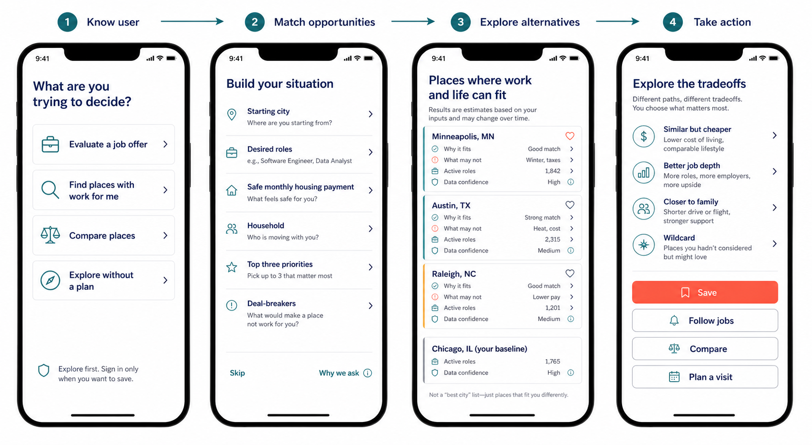

# WSIS Expansion Workshop

## Product direction

WSIS should become a relocation decision workspace:

> Know the user's situation → match it to real opportunities → explain viable
> places → let the user explore alternatives → turn the decision into action.

It should not open as if it already knows the visitor. Anonymous exploration is
the default; authentication appears only when someone wants to save, sync, share,
or receive alerts.

## Current nationwide data audit

The first national audit was run on July 4, 2026:

- 32,350 official 2025 Census places loaded with stable place GEOIDs.
- 2,095 active listings found in the current Simplify new-graduate source.
- 1,741 parseable U.S. city/state location assignments.
- 449 Census places matched to at least one active listing.
- 1,675 matched listing-to-place assignments.
- 66 U.S.-formatted locations remain unresolved and need alias, borough,
  township, unincorporated-place, or metro mapping.

Artifacts:

- `data/raw/census/places_2025.csv`
- `data/processed/national_job_city_coverage.csv`
- `data/processed/national_job_coverage_report.json`

This is source coverage, not total labor demand. The GitHub feed is narrow and
must be paired with BLS/O*NET facts and additional listing sources.

## Geographic model

The canonical city key should move from city-name strings to official geography:

- `place_geoid`: Census place/CDP identity
- `county_geoid`: county facts and county-spanning relationships
- `cbsa_code`: labor-market/metro identity
- `tract_geoid` and `zcta`: later neighborhood and postal resolution
- versioned aliases for `NYC`, `SF`, boroughs, townships, `DMV`, and job-board labels

City inclusion and job presence are separate concerns. Every official place can
be discoverable, while only places that pass a minimum coverage gate receive a
confident match or score.

## Data platform

### Foundation

1. Census TIGER/Gazetteer: places, coordinates, boundaries, geographic vintage.
2. Census place/county and urban-area/CBSA relationships.
3. ACS 5-year: population, income, housing, commute, education, migration,
   household composition, and margins of error.
4. Versioned source and geography dimensions in Postgres.

### Opportunity intelligence

1. BLS LAUS: unemployment by county/metro.
2. BLS OEWS and QCEW: occupational wages and industry employment by labor market.
3. O*NET: role taxonomy, skills, interests, and career adjacency.
4. USAJOBS API: current public federal opportunities.
5. Simplify GitHub feed: supplemental early-career technology listings.
6. Later licensed/approved feeds; never represent one board as the whole market.

Every listing should preserve source ID, raw location, normalized occupation,
place/CBSA match, remote/hybrid status, salary where available, first/last seen,
last verified, and location-match confidence. Zero means “none found in covered
feeds,” not “there are no jobs.”

### Move and life evidence

- HUD FMR plus ACS housing for affordability baselines.
- FBI UCR with reporting-completeness controls for safety.
- NOAA normals, FEMA National Risk Index, and EPA AQS for climate/hazards/air.
- ACS commute first; FTA NTD/GTFS and LODES for transit/work flows later.
- NCES for schools, HRSA/CMS for healthcare, FCC for broadband.
- IRS migration, BLS CPI, and transparent distance-based move-cost scenarios.
- USDA/NPS/OpenStreetMap for food access, parks, and amenities with licenses shown.

### Pipeline shape

```text
immutable raw snapshots
  → source-specific validation/quarantine
  → geography and occupation resolution
  → normalized source facts
  → coverage/quality gates
  → versioned published city + opportunity views
  → recommendation runs with input and model versions
```

Required provenance fields: source URL, retrieval time, effective date, vintage,
license, geographic level, GEOID, coverage percentage, margin of error, and
quality flags. Partial failures never replace last-known-good published data.

## Guest-first onboarding questions

The first useful match should require only five to seven interactions.

1. What are you trying to decide?
   - Evaluate a job offer
   - Find places with work for me
   - Compare places
   - Explore without a plan
2. Where are you starting from? Allow skip or no current city.
3. What roles or skills should we match? Ask work mode conditionally.
4. What monthly housing payment feels safe? Rent, buy, or unsure.
5. Who is this move for? Optional household/dependent shape.
6. Pick up to three priorities: career, housing, family/community, safety,
   car-free mobility, climate, culture/social life, outdoors, healthcare.
7. What are the deal-breakers? Allow “None yet.”

Rules:

- Never silently infer a current city, salary, household, or personal identity.
- Explain why each answer changes results.
- Let people skip, edit, delete, and choose “not sure.”
- Ask observable constraints before tastes.
- Separate hard deal-breakers from weighted preferences.
- Show conflicts instead of fabricating precision from missing answers.
- Delay deeper questions until after the first results.

### Preference questions without personality inference

WSIS should ask about desired environments rather than label someone introverted,
extroverted, political, or otherwise infer identity.

- “How much easy access to social activities do you want nearby?” — Low / Some /
  A lot / Not sure.
- “How do you feel about crowds and busy public spaces?” — Prefer quiet / A mix /
  Prefer lively / No preference.
- “What kind of place feels right?” — Major city / Mid-sized city / Small city or
  town / Open to any. Evaluate both Census-place scale and surrounding metro context.
- “How important is everyday access to trees, parks, or trails?”
- “Do you want frequent access to substantial natural areas or wildlife habitat?”
- Optional and off by default: “Would you like civic or political context included
  when comparing places?” — No / Context only / Broadly similar views / Mix of views.

Never infer these answers from location, name, browsing behavior, or third-party
profiles. Civic context uses dated official election/turnout data with geographic
limitations and never claims that every resident shares an identity. Resident posts
remain attributed anecdotes, not evidence that a city has a personality.

## Storyboard



1. **Land:** guest intent choice and clear value promise.
2. **Build the situation:** adaptive baseline, role, housing, household, priority,
   and deal-breaker questions.
3. **First match:** places with Why it fits, What may not, active roles, source
   confidence, and current-place baseline.
4. **Opportunity detail:** actual roles, occupational demand, wage range,
   cost-adjusted room, work-mode fit, source coverage, and freshness.
5. **City evidence:** housing, mobility, safety, hazards, environment, health,
   amenities, and missing evidence.
6. **Tradeoff lab:** adjust rent, salary, car, commute, weather, or household and
   see what changes without allowing soft scores to rescue failed constraints.
7. **Explore alternatives:** similar but cheaper, better job depth, closer to
   family, and one transparent wildcard.
8. **Take action:** save, follow jobs, compare, plan a scouting trip, estimate a
   move, verify missing evidence, negotiate salary/remote days/relocation help.
9. **Return:** show saved decisions and changed facts, never presumed personal facts.

## Feature roadmap

### P0 — decision value

- Offer evaluator with current-place baseline and post-housing scenario.
- Job-to-place/metro matching with dedupe, freshness, and coverage disclosure.
- Constraint-aware shortlist with explainable match, mismatch, and uncertainty.
- City comparison with hard constraints before aggregate scores.
- Saved scenarios and shareable read-only comparisons.

### P1 — retention and real-world action

- Alerts for matching jobs, material rent changes, stale evidence, and incentives.
- “What would make this viable?” salary/remote-days/housing negotiation targets.
- Neighborhood exploration anchored to commute destinations.
- Partner mode for two careers and shared constraints without merging private profiles.
- Scouting-trip planner and relocation incentive eligibility.

### P2 — broader opportunity discovery

- Career adjacency, apprenticeships, licenses, and training through O*NET.
- Entrepreneurship ecosystems, grants, universities, coworking, and volunteering.
- Move checklist, moving-cost estimate, lease/buy timeline, utilities, and registration.
- Climate/insurance warnings and moderated resident notes with sample-size labels.

## Authentication and privacy

Use Supabase Auth + Supabase Postgres for the MVP. It combines managed identity,
the planned relational database, and row-level security in one free-tier platform.
Codex/ChatGPT login is developer authentication, not a consumer identity provider
for WSIS. Any future OpenAI API key remains server-side.

Initial auth choices:

- Google and email magic link through PKCE.
- Anonymous browsing and onboarding first.
- Sign in only to save, sync, share privately, or receive alerts.
- React sends a short-lived Supabase access JWT to FastAPI.
- FastAPI verifies signature, issuer, audience, algorithm, expiry, and subject via JWKS.
- Every user-owned query is scoped by verified subject and protected by Postgres RLS.
- Service-role keys never enter the browser.

Collect salary bands rather than exact income when possible, broad location rather
than an address, and role/skill preferences rather than employer history. Provide
skip, reason-for-question, consent versioning, export, and deletion. Do not infer
protected traits or send raw profile answers to analytics or an LLM by default.

## Confirmed MVP decisions

1. **Geographic scope:** the 50 states. U.S. territories are deferred until after
   MVP; Washington, DC remains a second-round decision because it is not a state.
2. **Adaptive intent:** onboarding routes each visitor into offer evaluation,
   opportunity discovery, or anonymous exploration based only on answers they
   explicitly provide. A skipped intent leads to exploration without assumed facts.
3. **Recommendation size:** opportunity discovery returns five cities with matching
   jobs and explains why each was selected. Offer evaluation evaluates the city in
   the user's actual offer rather than replacing it with a generic ranking.
4. **Place universe and initial visibility:** retain the complete official place
   universe in the data platform, but initially publish and enrich approximately
   500–1,000 major/well-covered places. A national map shows major population centers;
   zooming progressively reveals smaller places with clear coverage warnings.
5. **Authentication:** Google and email magic-link are approved. Authentication is
   delayed until saving, syncing, sharing privately, or creating alerts.
6. **Financial privacy:** use salary and housing ranges by default. A user may enter
   exact values after an explicit explanation and consent. Financial data is used
   only to produce the user's decision support.
7. **Alerts:** ship matching-job and affordability-change alerts.
8. **Household scope:** MVP matches one person. Partner/two-career mode is deferred.
9. **DC:** Washington, DC is included alongside the 50 states.
10. **Offer presentation:** show the offered-city verdict as the primary result and
    place four alternatives directly beside/below it for comparison.
11. **Initial city gate:** publish approximately 750 places under one consistent
    population/data-quality threshold. Do not weaken the threshold to satisfy a
    per-state quota.
12. **Launch job scope:** prioritize technology, data, product, design, operations,
    marketing, and federal roles with salaries that plausibly support relocation.
    Other occupations use BLS/O*NET market evidence until honest live coverage exists.
13. **Job geography:** match local jobs to official CBSA/metro labor markets rather
    than exact municipal boundaries.
14. **Remote eligibility:** recommend a remote listing only where employer state
    eligibility is confirmed. Unknown eligibility is labeled and cannot count as a
    confirmed match.
15. **Exact financial values:** exact salary/rent values are session-only by default.
    Saving requires a separate explicit action and disclosure that the value will be
    retained for the user's own decision support.
16. **Alert defaults:** daily matching-job digest and weekly affordability digest,
    independently configurable and unsubscribable.
17. **Household questions:** optional household size/dependent questions may shape
    housing, school, and cost evidence without adding partner-career matching.
18. **Adaptive logic:** deterministic, versioned question and constraint rules for
    MVP. LLM-generated follow-up questions are deferred.
19. **Financial retention:** do not retain exact financial values unless the user
    explicitly authorizes storage.
20. **Political/civic context:** optional, off by default, and comparison-only for
    MVP. It cannot affect ranking even after opt-in.
21. **Small-place meaning:** ask whether the user accepts suburbs/exurbs inside a
    major metro or wants an independent smaller metro/town.
22. **Green access:** let users distinguish everyday parks/trees, weekend access to
    substantial trails/public lands, or both.
23. **Offer with no baseline:** evaluate constraints and affordability, then show
    four preference-matched alternatives. Do not add a national benchmark.
24. **Move-worthy salary:** determine viability from the user's housing, tax, and
    remaining-budget requirements. Do not impose one national salary floor.
25. **Reddit context:** use authenticated Reddit API results when access, sample size,
    attribution, and deletion compliance are workable. Show a separated “What some
    residents report” panel only; never use Reddit in ranking. If reliable collection
    proves difficult, omit the panel rather than scrape or fill the gap with seeded text.

## Reddit operating rules

Reddit currently requires OAuth for Data API access and enforces a free-access rate
limit. WSIS must use a descriptive user agent, respect rate-limit headers, and follow
the current Developer and Data API terms. Stored content must be reconciled against
deletions; routine deletion within 48 hours is the safest default for cached raw
content. WSIS should persist derived panel summaries only when their provenance and
deletion behavior can remain compliant. Reddit content is not used to train models.

If credentials, approval, coverage, moderation, or deletion reconciliation become
unreliable, set the panel to unavailable and continue with official evidence.

## Immediate build sequence

1. Replace name-based geography with Census GEOIDs and official crosswalks.
2. Pull nationwide ACS in bulk and establish city coverage gates.
3. Add CBSA/SOC dimensions and BLS/O*NET labor facts.
4. Add USAJOBS, improve listing location resolution, and create an unresolved queue.
5. Create Supabase schema/RLS and anonymous-to-account migration.
6. Build and user-test the guest onboarding storyboard before implementing the
   production React screens.
